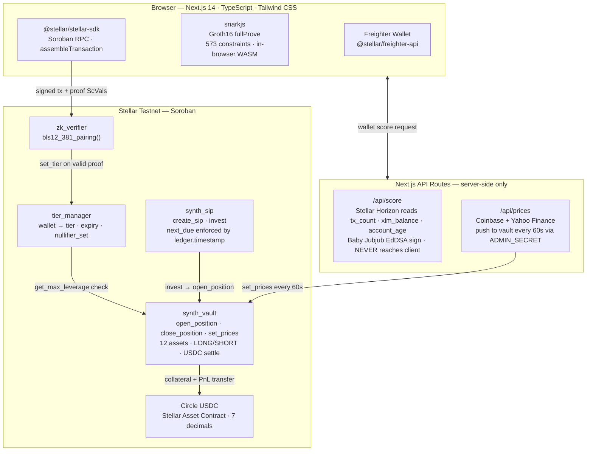
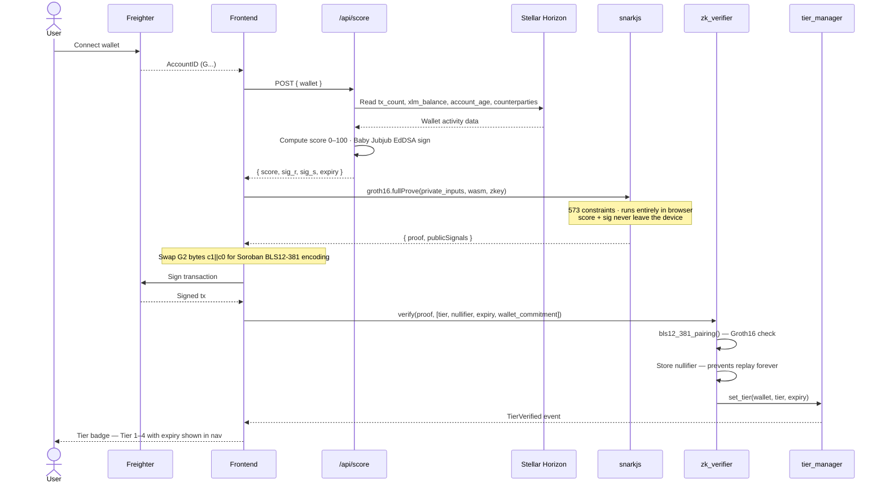
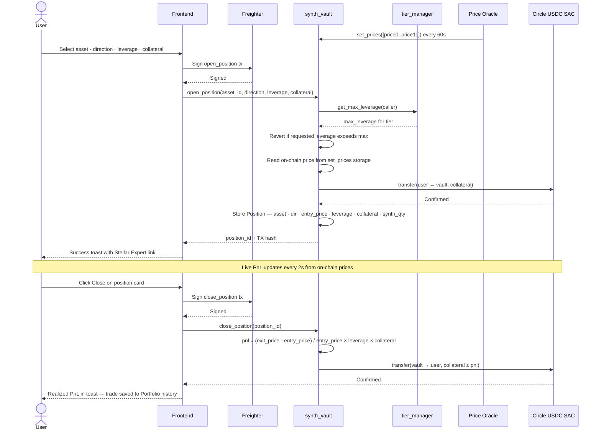
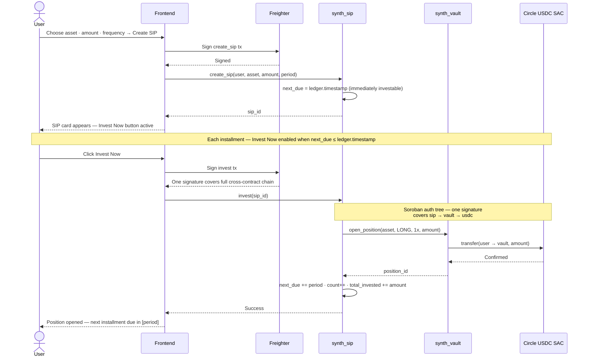

# Ztellar Edge — The First Privacy-Preserving Synthetic Stock Trading on Stellar

> **Prove your tier. Guard your identity. Trade with edge.**
>
> The first synthetic stock trading protocol on Stellar where KYC eligibility is enforced by a zero-knowledge proof — and your leverage cap is determined by a cryptographic tier that reveals nothing about who you are.

---

## The Problem in One Sentence

Billions of people hold stablecoins on Stellar's real-money rails — but they can't access leveraged synthetic equity exposure without either surrendering their identity to a custodian or posting 150% overcollateral to a protocol that treats everyone as equally untrusted.

---

## Why This Matters — Market Context

| Metric | Value |
|---|---|
| Stellar payment volume (Q1 2026) | **$5.5B+** processed on the network |
| Tokenized Real World Assets on Stellar | **$2B+** — Circle, MoneyGram, sovereign partners |
| Web3 identity & reputation market (2025) | **$1.20B** → projected **$12.80B by 2034** (28.9% CAGR) |
| People locked out of US equity markets | **4.3B+** — no brokerage access across Latin America, Africa, Southeast Asia |
| Synthetic stock demand in Stellar corridors | Persistent — remittance users already hold USDC and want equity exposure |

Stellar is not a niche chain. MoneyGram, Circle, and sovereign partners process real-money payments across the corridors where people need better financial tools. These users already hold stablecoins. Synthetic equity exposure on those rails is a natural next product. The infrastructure to serve them now exists — **Protocol 25 added native BLS12-381 host functions to Soroban**, making on-chain ZK proof verification affordable for the first time.

Without those host functions, full elliptic curve pairing math in pure Wasm would cost prohibitively many compute units. With them, an entire ZK-proven compliance gate fits inside a single Soroban transaction.

---

## Three Layers of the Problem

### 1. Full KYC or Nothing

Existing access-controlled DeFi requires users to either submit full PII (passport, address, face scan) to a custodian, or be locked out entirely. There is no middle path that grants calibrated access while preserving privacy. Legitimate, low-risk, privacy-conscious users are forced to choose between exposure and exclusion.

### 2. Overcollateralisation Is a Blunt Instrument

Without any signal about who a user is, protocols default to 150%+ collateral requirements for 1× exposure. This:
- Discriminates against legitimate users who have established history elsewhere
- Prevents the credit-based access that exists in traditional finance
- Makes leverage products inaccessible to users in emerging markets who cannot post 3× their position in collateral

### 3. On-Chain Reputation Is a Surveillance Vector

The few protocols that have attempted reputation systems expose the score publicly:

| Approach | Problem |
|---|---|
| On-chain credit scores (Spectral, Cred) | Fully public — any observer reconstructs your financial history |
| Centralized KYC gates | Require PII, create honeypot databases, must be trusted by user |
| Collateral-only models | Ignore reputation entirely — good and bad actors post the same margin |
| Soulbound tokens / POAPs | Prove identity but reveal it publicly — privacy is the casualty |

None of these preserve privacy while enabling differentiated, risk-calibrated access.

---

## The Solution — Ztellar Edge

Ztellar Edge is a two-layer system built natively on Stellar and Soroban.

**Layer 1 — ZK-Verified Access Gate**

Users generate a Groth16 zero-knowledge proof in their browser. The proof attests:
- They belong to a specific tier (1–4) based on wallet behavior scoring
- Their tier has not expired
- Their proof cannot be replayed (nullifier prevents reuse)
- Their personal data — wallet history, balance, raw score — never leaves their device

Only four values are ever posted on-chain: a tier number, a nullifier, an expiry timestamp, and a wallet commitment. The inputs stay private.

**Layer 2 — Synthetic Trading with Tier-Gated Leverage**

Based on the verified tier, users open synthetic long or short positions on 12 assets. Leverage caps are enforced atomically by the SynthVault Soroban contract — not by an admin:

| Tier | Label | Max Leverage | Collateral Required |
|---|---|---|---|
| 1 | Basic | 1× | 100% |
| 2 | Verified | 2× | 60% |
| 3 | Trusted | 5× | 30% |
| 4 | Premium | 10× | 15% |

---

## What Makes Ztellar Edge Unique

| Feature | Synthetix / GMX / dYdX | Traditional KYC (Onfido) | Spectral / Cred | **Ztellar Edge** |
|---|---|---|---|---|
| Privacy-preserving compliance | ❌ | ❌ Stores full PII | ❌ Score is public | ✅ ZK — only tier revealed |
| On-chain leverage enforcement | Fixed collateral | Off-chain only | Soft signals only | ✅ Hard caps enforced by contract |
| Replay protection | — | Credential theft risk | — | ✅ Cryptographic nullifier |
| Financial product layer | ✅ | ❌ | ❌ No trading | ✅ Full synthetic trading |
| Native Stellar integration | ❌ EVM only | ❌ | ❌ | ✅ Soroban · Freighter · SAC USDC |
| Systematic Investment Plans | ❌ | ❌ | ❌ | ✅ On-chain SIP Soroban contract |

Most projects do identity *or* privacy *or* trading. Ztellar Edge does all three in a single coherent product, natively on Stellar's real-money rails, targeting the exact users Stellar already serves.

---

## How Stellar's Protocol Features Are Used

### BLS12-381 Native Host Functions (Protocol 25)

Protocol 25 added native BLS12-381 elliptic curve operations as Soroban host functions:

| Host Function | Usage in Ztellar Edge |
|---|---|
| `bls12_381_g1_add` / `bls12_381_g1_mul` | Compute `vk_x = Σ vk_ic[i] × public_signals[i]` during proof verification |
| `bls12_381_g2_add` / `bls12_381_g2_mul` | G2 point operations during verifying key computation |
| `bls12_381_pairing` | Core Groth16 check: `e(πA, πB) = e(α, β) · e(vk_x, γ) · e(πC, δ)` |

**Key encoding detail:** Soroban BLS12-381 G2 affine points use `c1 (imaginary) || c0 (real)` byte ordering — opposite of the snarkjs default. The frontend serializer in `lib/stellar.ts` handles this swap explicitly before building the `ScVal`. Getting this wrong causes a silent WasmVm panic in `pairing_check`.

### Soroban Smart Contracts

Five production Soroban contracts coordinate the full system:

| Contract | Role |
|---|---|
| `zk_verifier` | Calls `bls12_381_pairing` to verify Groth16 proof; writes tier to `tier_manager` on success |
| `tier_manager` | Stores `wallet → (tier, expiry, nullifier)`; exposes `get_max_leverage()` |
| `synth_vault` | Reads tier, enforces leverage cap atomically, opens/closes positions, settles PnL in USDC |
| `synth_token` | SEP-0041 fungible token × 3 deployments (sAAPL, sTSLA, sNVDA) |
| `synth_sip` | Systematic Investment Plans — calls `vault.open_position` on a user-configured schedule |

### Stellar Asset Contract (SAC) — Circle Testnet USDC

All settlement is in USDC via the Stellar Asset Contract:

```
Issuer:   GBBD47IF6LWK7P7MDEVSCWR7DPUWV3NY3DTQEVFL4NAT4AQH3ZLLFLA5
SAC:      CBIELTK6YBZJU5UP2WWQEUCYKLPU6AUNZ2BQ4WWFEIE3USCIHMXQDAMA
Decimals: 7  (1 USDC = 10,000,000 units)
```

### Freighter Wallet + Soroban Auth Tree

Ztellar Edge is pure Stellar-native — no MetaMask, no bridges, no EVM. Soroban's `assembleTransaction` builds the complete cross-contract authorization tree, so a single Freighter popup covers multi-hop calls:

```
sip.invest()
  └→ vault.open_position()
       └→ usdc.transfer()
```
One user click. One signature. Three contracts.

---

## Technical Architecture



---

## Full Trade Flow

### Phase 1 — Identity: ZK Proof → On-Chain Tier



**Wallet Score Formula:**

| Signal | Weight |
|---|---|
| Transaction count | 30% |
| XLM balance | 25% |
| Account age (days) | 25% |
| Unique counterparties | 20% |

**Tier Thresholds:**

| Score Range | Tier | Max Leverage |
|---|---|---|
| 0 – 24 | 1 · Basic | 1× |
| 25 – 49 | 2 · Verified | 2× |
| 50 – 74 | 3 · Trusted | 5× |
| 75 – 100 | 4 · Premium | 10× |

---

### Phase 2 — Trade: Open and Close Synthetic Positions



---

### Phase 3 — SIP: Systematic Investment Plans



---

## ZK Circuit — `tier_proof.circom`

**Toolchain:** Circom 2.0 → snarkjs Groth16 → BLS12-381 on-chain verification  
**Constraints:** 573  
**Trusted setup:** Powers of Tau ceremony (artifacts in `circuits/ptau/`)  
**Browser proving:** WASM + zkey loaded from `/public/circuits/` — no server round trip

**Private inputs (never leave the browser):**

| Signal | Description |
|---|---|
| `wallet_secret` | Salted hash of wallet address — user-side entropy |
| `score` | Behavior score from oracle (0–100) |
| `sig_r`, `sig_s` | Baby Jubjub EdDSA signature from KYC oracle |
| `sig_pk_x`, `sig_pk_y` | Oracle's public key |

**Public outputs (posted on-chain):**

| Signal | Description |
|---|---|
| `tier` | u8: 1–4, derived from score thresholds in-circuit |
| `nullifier` | `Poseidon(wallet_secret, 1)` — prevents proof replay |
| `expiry` | Unix timestamp: proof validity window |
| `wallet_commitment` | `Poseidon(wallet_address, wallet_secret)` — binds proof to wallet |

**Circuit logic:**
```circom
// 1. Verify oracle signed the credential — no score leaves the browser
BabyJubjubVerifier(sig_r, sig_s, sig_pk, Poseidon(score, wallet, expiry)) === 1

// 2. Compute nullifier — proves uniqueness without revealing wallet_secret
nullifier <== Poseidon(wallet_secret, 1)

// 3. Bind proof to wallet address
wallet_commitment <== Poseidon(wallet_address, wallet_secret)

// 4. Derive tier from score with in-circuit range checks
tier <== TierFromScore(score)

// 5. Score range enforced in circuit (0–100 only)
score in [0, 100]
```

**Circuit artifacts:**

| File | Purpose |
|---|---|
| `circuits/tier_proof.circom` | Circuit definition |
| `frontend/public/circuits/tier_proof.wasm` | Browser WASM prover — intentionally committed |
| `frontend/public/circuits/tier_proof.zkey` | Proving key (trusted setup) — intentionally committed |
| `circuits/keys/verification_key.json` | Verifying key → loaded into `zk_verifier` at deploy time |

---

## Deployed Contracts — Stellar Testnet

> Last deployed: July 2026 · Network: Stellar Testnet

### Core Infrastructure

| Contract | Address |
|---|---|
| ZK Verifier | [`CAO4EYDG7B5OXUUONZWY6AAUGYQPZD66D2E5NPMKCBIYRO2D6ZEO3HX7`](https://stellar.expert/explorer/testnet/contract/CAO4EYDG7B5OXUUONZWY6AAUGYQPZD66D2E5NPMKCBIYRO2D6ZEO3HX7) |
| Tier Manager | [`CC7EF4NGJDLQECANFXHXA32UAHYQKVU6Z57COFSR2WIB5TMQL3G4EKQF`](https://stellar.expert/explorer/testnet/contract/CC7EF4NGJDLQECANFXHXA32UAHYQKVU6Z57COFSR2WIB5TMQL3G4EKQF) |
| Synth Vault | [`CDQANGYCMZQKYSR6GQAXR7FEF3PALRMEDR65ONKSSJGAVDI23DM5YNQM`](https://stellar.expert/explorer/testnet/contract/CDQANGYCMZQKYSR6GQAXR7FEF3PALRMEDR65ONKSSJGAVDI23DM5YNQM) |
| Synth SIP | [`CAQKC2LHNM7SCEK7FR6K2ET2JOBLDIXN27JQUMEZKJT7LLK75HL42QJT`](https://stellar.expert/explorer/testnet/contract/CAQKC2LHNM7SCEK7FR6K2ET2JOBLDIXN27JQUMEZKJT7LLK75HL42QJT) |
| Circle USDC (SAC) | [`CBIELTK6YBZJU5UP2WWQEUCYKLPU6AUNZ2BQ4WWFEIE3USCIHMXQDAMA`](https://stellar.expert/explorer/testnet/contract/CBIELTK6YBZJU5UP2WWQEUCYKLPU6AUNZ2BQ4WWFEIE3USCIHMXQDAMA) |

### Synthetic Token Contracts (SEP-0041)

| Symbol | Underlying | Address |
|---|---|---|
| sAAPL | Apple Inc. | [`CCJ2FSS234EZB7LE2JZLLRZXEVDX4QIN2GMK7EDA5XXNCNPYSQYOGYXX`](https://stellar.expert/explorer/testnet/contract/CCJ2FSS234EZB7LE2JZLLRZXEVDX4QIN2GMK7EDA5XXNCNPYSQYOGYXX) |
| sTSLA | Tesla Inc. | [`CD4HYGTAL7EZRYCGAPIXILCFZDN4RYLGJN4SYYIVHY56OAFWDVADDQZ4`](https://stellar.expert/explorer/testnet/contract/CD4HYGTAL7EZRYCGAPIXILCFZDN4RYLGJN4SYYIVHY56OAFWDVADDQZ4) |
| sNVDA | NVIDIA Corp. | [`CBHBEHJD2GSHSQY2MVJ464KZDL3QOZWZBQABP2VSFVRJQ4BUBXVJLTTK`](https://stellar.expert/explorer/testnet/contract/CBHBEHJD2GSHSQY2MVJ464KZDL3QOZWZBQABP2VSFVRJQ4BUBXVJLTTK) |
| sMSFT · sAMZN · sGOOG · sMETA · sNFLX · sAMD · sJPM · sSPY · sPFE | Various | Tracked as vault position entries (asset IDs 3–11) |

---

## Repository Structure

```
Ztellar-Edge/
│
├── circuits/                          # ZK circuit — Circom 2
│   ├── tier_proof.circom              # KYC tier attestation (573 constraints, Groth16)
│   ├── scripts/
│   │   ├── compile.js                 # circom → .wasm + .r1cs
│   │   └── setup.js                   # Powers of Tau → .zkey + verification_key.json
│   ├── keys/
│   │   └── verification_key.json      # Exported verifying key (→ zk_verifier init)
│   └── ptau/                          # Powers of Tau ceremony artifacts
│
├── contracts/                         # Soroban workspace (Rust)
│   ├── Cargo.toml                     # Workspace root
│   ├── rust-toolchain.toml            # Pinned toolchain for wasm32v1-none
│   ├── zk_verifier/src/lib.rs         # BLS12-381 Groth16 verifier → tier_manager
│   ├── tier_manager/src/lib.rs        # wallet → (tier, expiry, nullifier) storage
│   ├── synth_vault/src/lib.rs         # 12-asset vault, leverage enforcement, USDC settle
│   ├── synth_token/src/lib.rs         # SEP-0041 fungible token (sAAPL / sTSLA / sNVDA)
│   ├── synth_sip/src/lib.rs           # SIP — recurring vault.open_position calls
│   └── scripts/
│       ├── deploy.js                  # Deploy full suite; writes frontend/.env.local
│       ├── deploy_sip.js              # Deploy SIP contract standalone
│       └── init_prices.js             # Initialize vault price oracle
│
└── frontend/                          # Next.js 14 dApp
    ├── app/
    │   ├── page.tsx                   # Landing page
    │   ├── trade/page.tsx             # Trade dashboard — open/close positions
    │   ├── portfolio/page.tsx         # Portfolio — open positions, SIPs, trade history
    │   ├── sip/page.tsx               # SIP management
    │   ├── prove/page.tsx             # ZK proof generation flow (4-step)
    │   └── api/
    │       ├── score/route.ts         # Wallet behavior scoring via Stellar Horizon
    │       └── prices/route.ts        # Price oracle → vault.set_prices every 60s
    ├── hooks/
    │   ├── use-positions.ts           # Open positions, close, PnL polling
    │   ├── use-sip.ts                 # SIP CRUD + invest
    │   ├── use-tier.ts                # Tier query and expiry display
    │   └── use-prices.ts              # Live price polling (2s interval)
    ├── lib/
    │   ├── stellar.ts                 # All Soroban tx builders + BLS12-381 serializer
    │   ├── contracts.ts               # Contract address registry
    │   ├── zk.ts                      # snarkjs in-browser proof generation wrapper
    │   └── trade-history.ts           # localStorage closed trade persistence
    └── public/
        └── circuits/
            ├── tier_proof.wasm        # Browser WASM prover (intentionally committed)
            └── tier_proof.zkey        # Proving key (intentionally committed)
```

---

## Tech Stack

| Layer | Technology |
|---|---|
| Smart contracts | Rust · Soroban SDK · `wasm32v1-none` target |
| ZK proofs | Circom 2.0 · snarkjs (Groth16 in browser) · Baby Jubjub EdDSA |
| On-chain ZK verification | Stellar BLS12-381 host functions (`bls12_381_pairing`) |
| Frontend | Next.js 14 · React 18 · TypeScript · Tailwind CSS |
| Wallet | Freighter (`@stellar/freighter-api`) |
| Stellar SDK | `@stellar/stellar-sdk` |
| Price oracle | Next.js API route · Coinbase Data API · Yahoo Finance |
| Settlement | Circle Testnet USDC · Stellar Asset Contract (SAC, 7 decimals) |
| Testnet | Stellar Testnet · Soroban RPC · Stellar Expert |

---

## Local Setup

### Prerequisites

- Node.js 20+
- Rust with `wasm32v1-none` target: `rustup target add wasm32v1-none`
- [Freighter](https://freighter.app) browser extension → Settings → Enable Testnet
- Stellar testnet XLM from [Stellar Friendbot](https://friendbot.stellar.org)
- Testnet USDC from [Circle's faucet](https://faucet.circle.com)

### Install and Run

```bash
cd frontend
npm install
npm run dev       # http://localhost:3000
```

The price oracle runs as a Next.js API route — no separate process needed.

### Environment

**`frontend/.env.local`** — copy this for local dev against the deployed contracts:

```env
NEXT_PUBLIC_STELLAR_NETWORK=testnet
NEXT_PUBLIC_ZK_VERIFIER_CONTRACT_ID=CAO4EYDG7B5OXUUONZWY6AAUGYQPZD66D2E5NPMKCBIYRO2D6ZEO3HX7
NEXT_PUBLIC_TIER_MANAGER_CONTRACT_ID=CC7EF4NGJDLQECANFXHXA32UAHYQKVU6Z57COFSR2WIB5TMQL3G4EKQF
NEXT_PUBLIC_SYNTH_VAULT_CONTRACT_ID=CDQANGYCMZQKYSR6GQAXR7FEF3PALRMEDR65ONKSSJGAVDI23DM5YNQM
NEXT_PUBLIC_SYNTH_AAPL_CONTRACT_ID=CCJ2FSS234EZB7LE2JZLLRZXEVDX4QIN2GMK7EDA5XXNCNPYSQYOGYXX
NEXT_PUBLIC_SYNTH_TSLA_CONTRACT_ID=CD4HYGTAL7EZRYCGAPIXILCFZDN4RYLGJN4SYYIVHY56OAFWDVADDQZ4
NEXT_PUBLIC_SYNTH_NVDA_CONTRACT_ID=CBHBEHJD2GSHSQY2MVJ464KZDL3QOZWZBQABP2VSFVRJQ4BUBXVJLTTK
NEXT_PUBLIC_USDC_CONTRACT_ID=CBIELTK6YBZJU5UP2WWQEUCYKLPU6AUNZ2BQ4WWFEIE3USCIHMXQDAMA
NEXT_PUBLIC_SYNTH_SIP_CONTRACT_ID=CAQKC2LHNM7SCEK7FR6K2ET2JOBLDIXN27JQUMEZKJT7LLK75HL42QJT

# Server-side only — NEVER prefix with NEXT_PUBLIC_
ADMIN_SECRET=<vault admin keypair for price oracle>
```

---

## End-to-End Test Flow

1. **Connect wallet** — click "Connect Freighter" → approve → Stellar address appears in nav
2. **Get testnet USDC** — [Circle faucet](https://faucet.circle.com) → paste Stellar testnet address → receive 10 USDC
3. **Prove Identity** (`/prove`) → oracle scores wallet → snarkjs Groth16 in browser (5–15s) → Freighter sign → tier badge in nav
4. **Open a position** (`/trade`) → select asset · direction · leverage (capped by tier) → Freighter sign → success toast with TX hash + Stellar Expert link
5. **View portfolio** (`/portfolio`) → live unrealized PnL every 2s · active SIPs with next-due countdown · closed trade history
6. **Create a SIP** (`/sip`) → configure asset · amount · period → Freighter sign → "Invest Now" button active when `next_due ≤ now`
7. **Close a position** → "Close" on any position card → Freighter sign → realized PnL in toast → trade appended to history

---

## Circuit Regeneration (Advanced)

Only needed if you modify `tier_proof.circom`:

```bash
cd circuits
node scripts/compile.js       # circom → .wasm + .r1cs
node scripts/setup.js         # ptau ceremony → .zkey + verification_key.json
```

After regeneration: copy artifacts to `frontend/public/circuits/`, redeploy `zk_verifier` with the new verifying key, update `NEXT_PUBLIC_ZK_VERIFIER_CONTRACT_ID`.

---

## Acknowledgements

- [Stellar Development Foundation](https://stellar.org/) — Soroban, BLS12-381 host functions, Protocol 25, Freighter wallet, SEP-0041
- [iden3](https://iden3.io/) — circom, snarkjs, Baby Jubjub EdDSA curve
- [Circle](https://www.circle.com/) — Testnet USDC and the Stellar Asset Contract
- [Stellar Expert](https://stellar.expert/) — Testnet contract explorer and transaction lookup

---

## License

MIT

---

*Built for [Stellar Hacks: Real-World ZK](https://dorahacks.io/hackathon/stellar-hacks) · Submission deadline: June 29, 2026*
